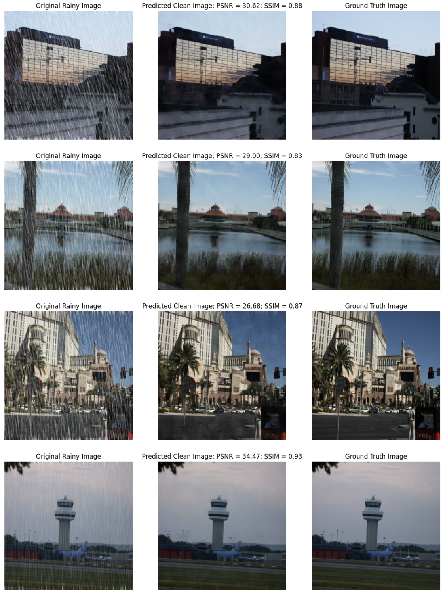

# Deraining Images using Neural Networks

## Overview
This project leverages deep learning techniques to remove rain streaks from images, improving visual clarity for applications like autonomous driving, surveillance, and photography. The approach combines advanced preprocessing methods, a ResNet-based architecture, and performance evaluation using metrics like PSNR and SSIM. Non-deep learning methods were also tested and can be found in image_processing.ipynb.

---

## Features
- **Preprocessing:**
  - Resizing images to a fixed 256x256 resolution.
  - Normalization for efficient neural network convergence.
- **ResNet-Based Architecture:**
  - Residual blocks for preserving image details.
  - Final output ensures high-quality RGB images.
- **Evaluation Metrics:**
  - **PSNR (Peak Signal-to-Noise Ratio):** Indicates pixel-wise accuracy.
  - **SSIM (Structural Similarity Index):** Measures perceptual quality.
- **Results:**
  - SSIM: 0.79 to 0.93
  - PSNR: 24.5 to 31.60 dB

---

## Tech Stack
- **Programming Language:** Python
- **Libraries:** TensorFlow, NumPy, OpenCV
- **Model:** Custom ResNet architecture

---

## Sample Outputs

---

## Dataset
The dataset includes pairs of rainy images and their ground truth (rain-free images). It can be accessed [here](https://github.com/jinnovation/rainy-image-dataset).

---
